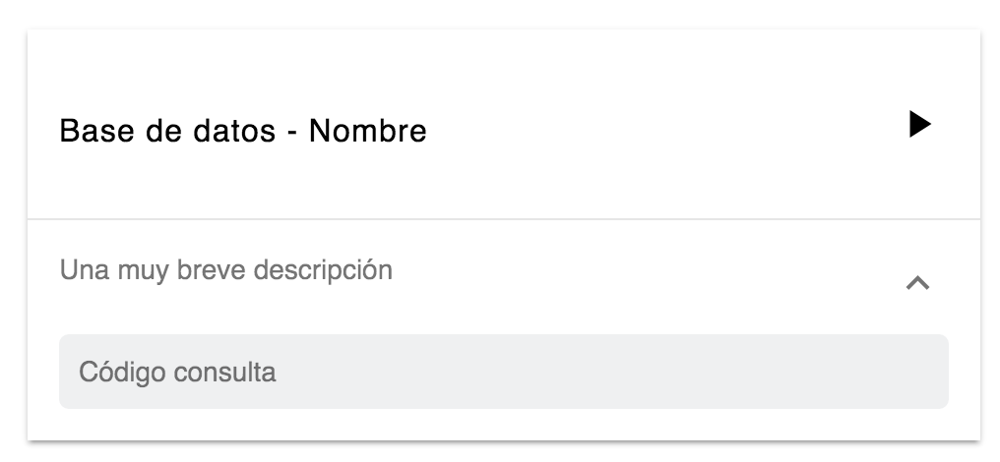

# FlaskDB

## Requisitos
<!-- * MongoDB corriendo, conectada con la aplicación usando el nombre de la database.
* PostgreSQL corriendo, conectada con la aplicación usando un nombre de usuario, constraseña y el nombre de la database. -->

* 🐘 [PostgreSQL](https://www.postgresql.org/download/)
* 🍃 [MongoDB](https://www.mongodb.com/download-center?jmp=nav#community)
* ⚗ [Flask](http://flask.pocoo.org/docs/0.11/installation/)
* Instalar requerimientos:
```
pip3 install -r requirements.txt
```

## Uso
1. Iniciar las bases de datos
2. Iniciar la aplicación:
```shell
export FLASK_APP=flaskr
python3 -m flask run
```

Nuestra aplicación correrá [aquí](http://127.0.0.1:5000/) y al iniciarla verás algunas tarjetas como la de la figura. Cada una de ellas representa una consulta a nuestras bases de datos.


<!--  -->

Cada tarjeta contiene:
* un nombre,
* una descripción,
* una base de datos
* y una consulta.

Toda esta información es posible modificarla en el archivo **queries**, el que se explicará más adelante.

Adicionalmente, cada tarjeta contiene un botón _play_ que desplegará una representación de la consulta. Por defecto, la aplicación mostrara una tabla y un JSON para cada consulta en postgreSQL y mongoDB, respectivamente.

Para estar más familiarizado con Flask, puedes encontrar [aquí](http://flask.pocoo.org/) la información necesaria.

## Estructura

El archivo principal es _flaskr.py_, en él está toda la lógica de esta pequeña aplicación. Existen tres rutas principales y funciones asociadas a ellas.

Primero, en la raíz de la aplicación encontramos la función _home()_. En ella se leen todas las consultas del archivo **queries** y se almacenan en la variable _pairs_. Estos datos serán visualizados en **templates/file.html**.

```python
@app.route("/")
def home():
  with open(QUERIES_FILENAME, 'r') as queries_file:
        json_file = json.load(queries_file)
        pairs = [(x["name"], x["database"], x["description"], x["query"]) for x in json_file]
        return render_template('file.html', results = pairs)
```

Luego, las funciones _mongo()_ y _postgres()_ definen el comportamiento de las rutas con los mismos nombres. Estas funciones son llamadas al presionar _play_ en una consulta y se encargan de pedir los datos necesarios para ella. Cada función llama a un archivo HTML y le entrega estos datos en la variable _results_.

En la carpeta *static* se almacenan los archivos CSS, JavaScript y las imágenes de la aplicación. Para mejorar el estilo o agregar funcionalidades con JavaScript, puedes modificar los archivos de este directorio.

En la carpeta **templates** se almacenan todos los archivos HTML de la aplicación. Esta aplicación Flask funciona con Jinja2, para aprender más sobre (cómo se llama esto? Jinja2), puedes leer su documentación [aquí](hola.cl). Para modificar la estructura de la visualización de los resultados de una consulta, es posible editar los archivos **templates/mongo.html** y **templates/postgres.html**.

Por último, en el archivo **queries** se encuentran todas las consultas que se muestran en la aplicación. Cada consulta tiene el formato:
``` JSON
{
  "name": "Consulta 1",
  "database": "postgres",
  "description": "Lorem ipsum dolor sit amet, consectetur adipiscing elit",
  "query": "SELECT * FROM mytable;"
}
```
<!-- * templates -->
<!-- * static -->
<!-- * archivo queries -->
